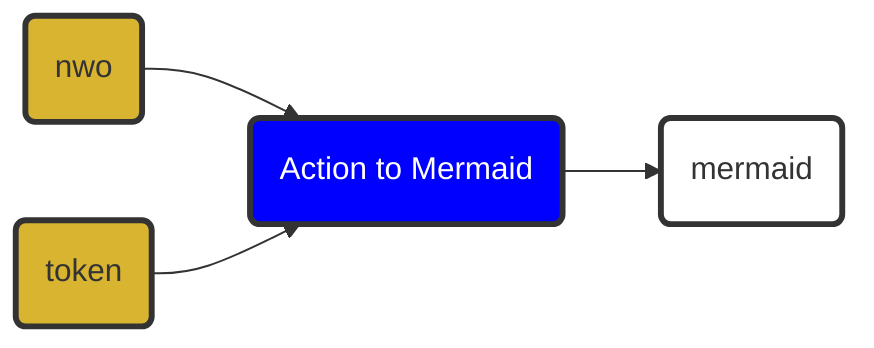

# Action to Mermaid 
> ▶️ to 🧜‍♀️

## About

Now that [GitHub renders Mermaid diagrams](https://github.blog/2022-02-14-include-diagrams-markdown-files-mermaid/), here is a GitHub action that generates a [Mermaid diagram](https://mermaid-js.github.io/mermaid/#/) out of an action's metadata file.

## Overview

<!-- START MERMAID -->

<!-- END MERMAID -->

## Example usage

```yml
name: Mermaid

on:
  # Upon push to action.yml in the main branch
  push:  
    branches: [ main ]
    paths:
      - action.yml
  # Or upon manual trigger
  workflow_dispatch:

jobs:
  mermaid:
    runs-on: ubuntu-latest

    steps:
      - uses: actions/checkout@v2

      # Get Mermaid diagram for the action repository this workflow runs in
      # Use `nwo` option to change the action repository
      - name: Get Mermaid diagram
        id: mermaid
        uses: imjohnbo/action-to-mermaid@v0

      # Do something with Mermaid diagram, e.g. update README, output to separate file, etc.
      - name: Echo Mermaid diagram
        env:
          MERMAID: ${{ steps.mermaid.outputs.mermaid }}
        run: |-
          echo "$MERMAID"
```

## Example output

````

````

## License

[MIT](LICENSE)

## Contributing

Pull requests are welcome!
