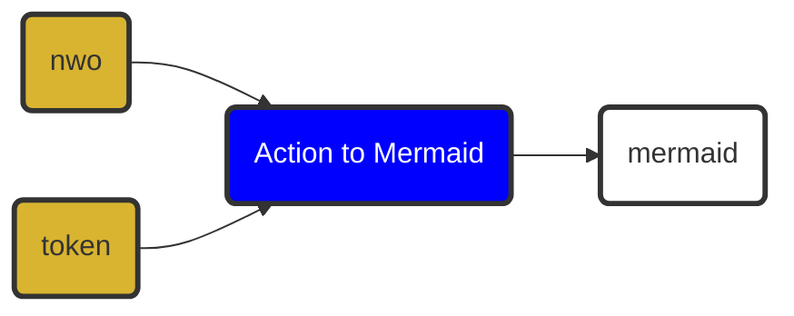

```mermaid
flowchart LR
input1(nwo):::optional-->action(Action to Mermaid):::action
input2(token):::optional-->action(Action to Mermaid):::action
action(Action to Mermaid)-->output1(mermaid):::output
classDef required fill:#6ba06a,stroke:#333,stroke-width:3px
classDef optional fill:#d9b430,stroke:#333,stroke-width:3px
classDef action fill:blue,stroke:#333,stroke-width:3px,color:#ffffff
classDef output fill:#fff,stroke:#333,stroke-width:3px,color:#333
```
